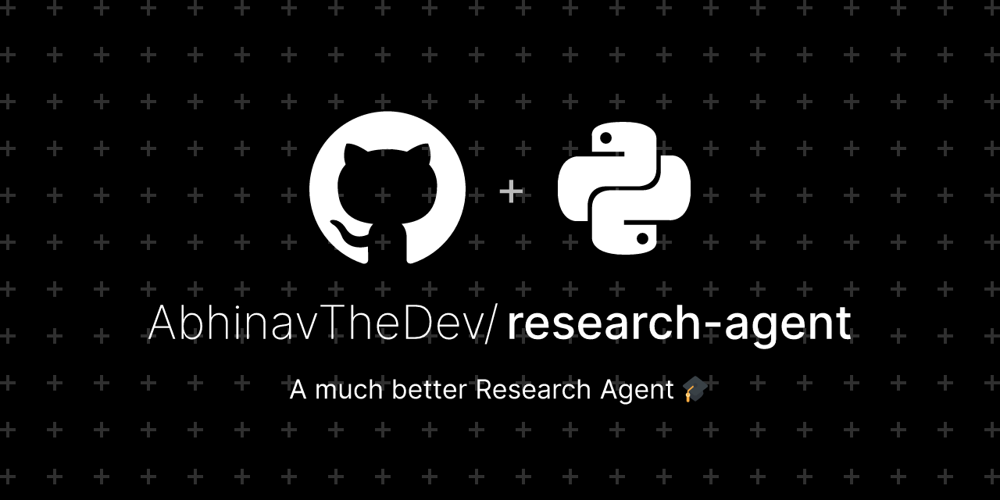

# RESEARCH AGENT

[//]: 

## ⭐ About

- Open Source Web App for your complex research tasks.
- Built with NextJS and Langchain
- Uses Langgraph's research assistant framework for research workflow.
- Provide Comprehensive Research on any topic in a single click.
- Uses Langchain's LLMs and Agents to provide a research assistant.
- Uses ShadCN UI for a beautiful and responsive UI.
- Uses Tailwind CSS for styling.
- Uses FastAPI for the backend.
- Uses Langgraph for the research assistant framework.
- Uses Python for the backend.
- Uses GROQ API for the research assistant.

### Hammer & Wrench: Tech Stack 🛠

<!-- markdownlint-disable MD033 -->
<div align="center">
  
  
  
  
  
  
  
</div>

### Outbox Tray: Set up

#### **Setting Up the Agent**

##### **1. Get an API Key**

- Obtain a **GROQ_API_KEY**.

##### **3. Set Up the Backend**

- Navigate to the backend folder:

   ```sh
   cd backend
   ```

- Install dependencies using Pip:

   ```sh
   pip install -r requirements.txt
   ```

- Create a `.env` file inside the `./backend` directory with your **GROQ_API_KEY**:

   ```py
   GROQ_API_KEY=YOUR_API_KEY_HERE
   ```

- Run the agent server:

   ```sh
   python server.py
   ```

#### Server is now running on `https://localhost:8000`

##### **4. Set Up the Frontend**

- Navigate to the frontend directory in separate terminal window:

   ```sh
   cd frontend
   ```

- Install dependencies using npm:

   ```sh
   npm i
   ```

- Run the Next.js project:

   ```sh
   npm run dev
   ```

#### **Troubleshooting** ❓

1. Ensure no other local application is running on port **8000**.
2. In the file `/backend/server.py`, change the address from `0.0.0.0` to `127.0.0.1` or `localhost` if needed.
3. Add correct GROQ API Keys in `.env` file before running server.

### Contact me 👀

Hi, I'm Dan, a fullstack MERN developer and this is my first open AI first application. Let me know if you have any questions or suggestions. I would love to hear from you!  
Connect with me on [LinkedIn](https://www.linkedin.com/in/dan-chanivet-574084b2/), and check out my other projects on [GitHub](https://github.com/flan02).
